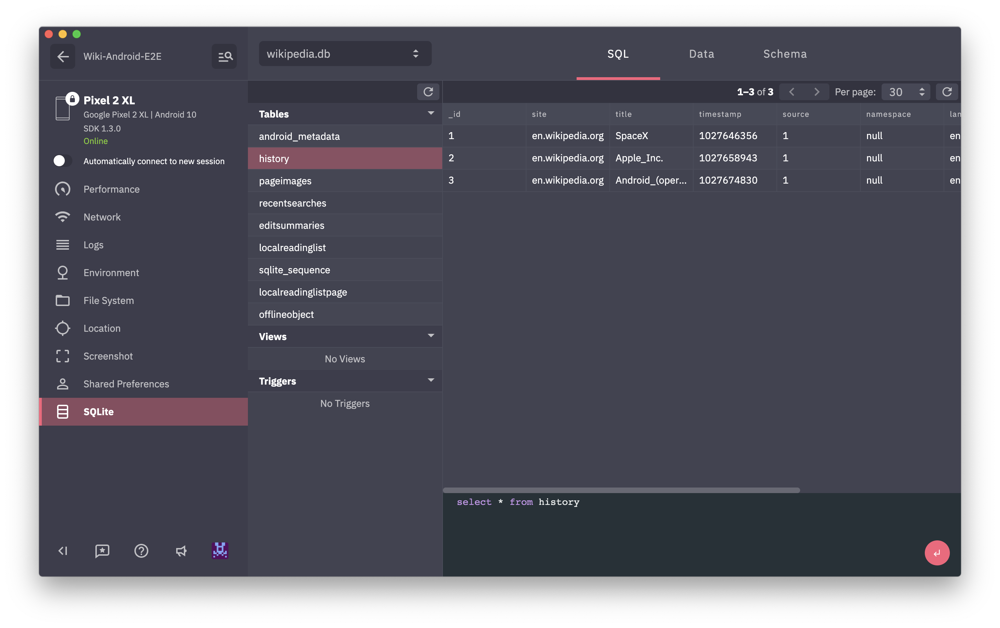
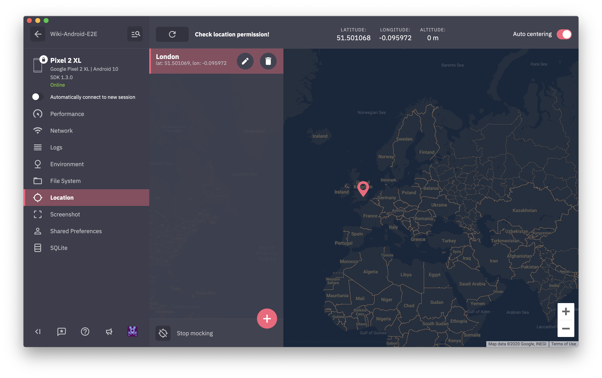
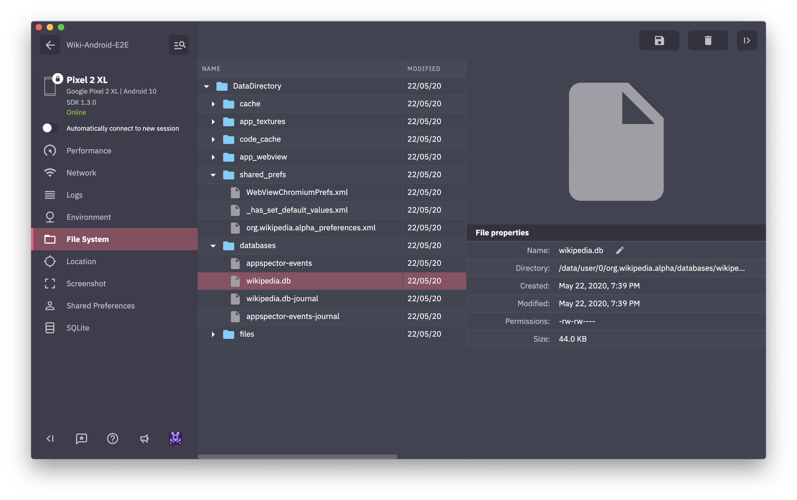

# [](https://appspector.com?utm_source=android_readme)

With AppSpector you can remotely debug your app running in the same room or on another continent.
You can measure app performance, view database content, logs, network requests and many more in realtime.
This is the instrument that you've been looking for. Don't limit yourself only to simple logs.
Debugging doesn't have to be painful!

* [Installation](#installation)
  * [Gradle dependency](#add-appspector-sdk-to-your-project)
  * [Initialize AppSpector](#initialize-appspector-sdk)
  * [Use End-To-End Encryption to protect your data](#use-end-to-end-encryption-to-protect-your-data)
  * [Build and Run](#build-and-run)
* [Upgrading the AppSpector SDK from older versions](upgrading-the-appspector-sdk-from-older-versions)
* [Configure](#configure)
  * [SDK start/stop](#sdk-startstop)
  * [Custom device name](#custom-device-name)
  * [Support SQLCipher](#support-sqlcipher)
  * [Filtering your data](#filtering-your-data)
    * [Filtering HTTP requests and responses](#filtering-http-requests-and-responses)
    * [Filtering SharedPreferences values and files](#filtering-sharedpreferences-values-and-files)
    * [Filtering Logs](#filtering-logs)
    * [Applying filters](#applying-filters)
  * [Getting session URL](#getting-session-url)
  * [Disable background data collection](#disable-background-data-collection)
  * [Network Monitor configuration](#network-monitor-configuration)
* [Features](#features)

# Installation

Each app you want to use with AppSpector SDK you have to register on our
service through the web ([https://app.appspector.com](https://app.appspector.com?utm_source=android_readme))
or the [desktop app](https://appspector.com/download/?utm_source=android_readme).
After adding the application navigate to app settings and copy API key.

## Add AppSpector SDK to your project
<!-- integration-manual-start -->
[](https://github.com/appspector/android-sdk/releases)

#### Modify your app-level build.gradle
```kotlin
apply plugin: 'com.android.application'

// Add AppSpector maven repository
repositories {
    maven { url "https://maven.appspector.com/artifactory/android-sdk" }
}

dependencies {
    implementation "com.appspector:android-sdk:1.+"
}
```

In case when you don't want to have AppSpector SDK in your release APK use AppSpector NO-OP artifact
```groovy
dependencies {
    debugImplementation "com.appspector:android-sdk:1.6.+"
    releaseImplementation("com.appspector:android-sdk:1.6.+") {
      exclude group: 'com.appspector', module: 'android-core'
    }
}
```
<!-- integration-manual-end -->


## Initialize AppSpector SDK
<!-- initialization-manual-start -->
```java
import android.app.Application;

import com.appspector.sdk.AppSpector;

public class AmazingApp extends Application {

   @Override
   public void onCreate() {
      super.onCreate();
      
      // We recommend to start AppSpector from Application#onCreate method
      
      // You can start all monitors
      AppSpector
            .build(this)
            .withDefaultMonitors()            
            .run("API_KEY");
            
      // Or you can select monitors that you want to use
      AppSpector
            .build(this)
            .addPerformanceMonitor()
            .addLogMonitor()
            // Next line disables added monitor above. In our case, Log and Performace monitors.
            .disableProvidedMonitors() // Disabled monitors can be enabled from Dashboard.
            .addHttpMonitor()
            .addScreenshotMonitor()
            .addSQLMonitor()
            // Monitors that were not added to config will be ignored till declared here.
            .run("API_KEY");
   }

}
```
<!-- initialization-manual-end -->


## Use End-To-End encryption to protect your data

AppSpector SDK collects and stores user data including logs, database content
and network traffic. All of this can contain sensitive data so to protect
your privacy we offer an additional module with E2EE feature. It allows
you to encrypt all data AppSpector sends from or to your device and be sure
only you can decrypt it. Due to security reasons encrypted sessions are only
available in [desktop application](https://appspector.com/download/?utm_source=android_readme).

To use encryption you must select the `Enable End-To-End encryption` option
during the registration of your app using [desktop application](https://appspector.com/download/?utm_source=android_readme)
(previously registered application can't be updated to support encryption).

After that, you need to add the `android-sdk-encryption` module to your
dependencies declaration. So, your app-level `build.gradle` should contain the next lines:

```groovy
apply plugin: 'com.android.application'

// Add AppSpector maven repository
repositories {
    maven { url "https://maven.appspector.com/artifactory/android-sdk" }
}

dependencies {
    implementation "com.appspector:android-sdk:1.+"
    implementation 'com.appspector:android-sdk-encryption:1.+'
}
```

Finally, enable encryption by putting the `enableEncryption` to SDK
configuration. The client `Public Key` you can find on the application settings screen.

<!-- e2e-start -->
```java
AppSpector
            .build(this)
            .withDefaultMonitors() 
            .enableEncryption("CLIENT_PUBLIC_KEY")
            .run("API_KEY");
```

<!-- e2e-end -->


## Build and Run

Build your project and see everything work! When your app is up and running you can go to [https://app.appspector.com](https://app.appspector.com?utm_source=android_readme) and connect to your application session.


# Upgrading the AppSpector SDK from older versions

<!--upgrade-manual-start -->

**Important:** Old SDK versions (pre v1.5.0) included a Gradle Plugin which is no longer available. Please follow these steps to migrate your project to the new integration method:

### Step 1: Remove the plugin from your app-level `build.gradle` file

**For Groovy DSL (`build.gradle`):**
```groovy
apply plugin: 'com.android.application'
// TODO: Remove the next line
apply plugin: 'com.appspector.sdk'
```

**For Kotlin DSL (`build.gradle.kts`):**
```kotlin
plugins {
    id("com.android.application")
    // TODO: Remove the next line
    id("com.appspector.sdk")
}
```

### Step 2: Clean up your project-level `build.gradle` file

Remove the AppSpector plugin from your project-level build file:

**For Groovy DSL (`build.gradle`):**
```groovy
buildscript {
    dependencies {
        classpath 'com.android.tools.build:gradle:8.0.0'
        // TODO: Remove the next line
        classpath 'com.appspector:android-sdk-plugin:1.4.0'
    }
}
```

**For Kotlin DSL (`build.gradle.kts`):**
```kotlin
buildscript {
    dependencies {
        classpath("com.android.tools.build:gradle:8.0.0")
        // TODO: Remove the next line
        classpath("com.appspector:android-sdk-plugin:1.4.0")
    }
}
```

### Step 3: Add the new dependency

Add the AppSpector SDK as a regular dependency in your app-level `build.gradle` file:

**For Groovy DSL (`build.gradle`):**
```groovy
dependencies {
    implementation 'com.appspector.android:appspector:1.6.0'
}
```

**For Kotlin DSL (`build.gradle.kts`):**
```kotlin
dependencies {
    implementation("com.appspector.android:appspector:1.6.0")
}
```

### Step 4: Update monitor configuration

Since the plugin handled network monitoring automatically, you now need to manually configure network monitors. See the [Network Monitor configuration](#network-monitor-configuration) section below for details on setting up OkHttp interceptors or URLConnection instrumentation.

### Step 5: Clean and rebuild

After making these changes:
1. Clean your project: `./gradlew clean`
2. Rebuild your project: `./gradlew build`

<!--upgrade-manual-end -->


# Configure

## SDK start/stop

After calling the `run` method the SDK starts data collection and
data transferring to the web service. From that point you can see
your session in the AppSpector client.

Since we recommend to keep SDK initialization in the `onCreate()` method
of your [Application](https://developer.android.com/reference/android/app/Application),
the SDK provides methods to help you control AppSpector state by
calling `stopSdk()` and `startSdk()` static methods.
**You are able to use these methods only after AppSpector was initialized.**

The `stop()` tells AppSpector to disable all data collection and close current session.

```java
AppSpector.stopSdk();
```

The `startSdk()` starts it again using config you provided at initialization.

```java
AppSpector.startSdk();
```

**As the result new session will be created and all activity between
`stop()` and `start()` calls will not be tracked.**

To check AppSpector state you can use `isStarted()` method.

```java
AppSpector.shared().isStarted();
```

## Custom device name

You can assign a custom name to your device to easily find needed sessions
in the sessions list. To do this you should add the desired name as a value
for `AppSpector.METADATA_KEY_DEVICE_NAME` key to the `metadata` dictionary:

```java
AppSpector
            .build(this)
            .withDefaultMonitors()
            .addMetadata(AppSpector.METADATA_KEY_DEVICE_NAME, "YOUR_DEVICE_NAME")
            .run("YOUR_API_KEY");
```

Also, the SDK allows managing the device name during application lifetime using

the `setMetadataValue` method to change device name

```java
AppSpector.shared().setMetadataValue(AppSpector.METADATA_KEY_DEVICE_NAME, "NEW_DEVICE_NAME");
```

or the `removeMetadataValue` to remove your custom device name

```java
AppSpector.shared().removeMetadataValue(AppSpector.METADATA_KEY_DEVICE_NAME);
```

## Support SQLCipher
For browsing and running SQL queries in the SQLCipher database you need to perform a couple of additional steps.
First of all, add the `sqlcipher-extension` module to your `app/build.gradle` file under the main sdk module. So, it'll look like that:

```groovy
dependencies {
    implementation 'com.appspector:android-sdk:1.+'
    implementation 'com.appspector:sqlcipher-extension:1.+'
}
```

After that, create DatabaseConnectionFactory and pass it as an argument of the `addSQLMonitor` method.

Let's imagine your project contains SQLCipher database with "my_encrypted_db" name and other SQLite ones:

```java
AppSpector
            .build(this)
            .withDefaultMonitors()
            .addSQLMonitor(new SQLiteMonitor.DatabaseConnectionFactory() {
                @NonNull
                @Override
                public DatabaseConnection createDatabaseConnection(@NonNull Database database) {
                    if ("my_encrypted_db".equals(database.name)) {
                        return new SQLCipherDatabaseConnection(database, "password");
                    }
                    return new SQLiteDatabaseConnection(database);
                }
            })
            .run("YOUR_API_KEY");
```


## Filtering your data
Sometimes you may want to adjust or completely skip some pieces of data AppSpector gather. 

### Filtering HTTP requests and responses
For this aim, the HTTP monitor provides the interface `HTTPFilter` which can be pass to `addHttpMonitor(HTTPFilter)` method.

Let's say we want to skip our auth token from requests headers. Here is a sample of this filter:
```java
public class TokenFilter implements HTTPFilter {
    @Nullable
    @Override
    public HttpRequest filter(HttpRequest request) {
        if (request.getHeaders().containsKey("YOUR-AUTH-HEADER")) {
             request.getHeaders().remove("YOUR-AUTH-HEADER");
        }
        return request;
    }

    @Nullable
    @Override
    public HttpResponse filter(HttpResponse response) {
        return response;
    }
}
```

### Filtering SharedPreferences values and files
The SharedPreferences monitor allows specifying files you want to observe by using `SharedPreferencesSourceFactory`.
1. To observe all SharedPreferences files it provides `SharedPreferencesSourceFactory.all()` method. By default, the monitor uses this value.
2. To ignore some files it provides `SharedPreferencesSourceFactory.excludeFiles("preferences_name")` method, where "preferences_name" is a name of ignored file. You may pass as many file names as you want.
3. To observe only specified file it provides `SharedPreferencesSourceFactory.only("preferences_name")` method, where "preferences_name" is a name of file for observing. This method also receives as many argumens as you want. 

In additinal, the monitor allows to provide `SharedPreferencesMonitor.Filter` for removing or modifying some values before sending data on client.

Let's say you want to remove `key_1` and modify `key_2` preferences in the file `preferences_name`. So, your filter will look like that: 
```java
public class SimpleSharedPreferencesFilter implements SharedPreferencesMonitor.Filter {
    @NonNull
    @Override
    public Map<String, PreferenceValue> filter(@NonNull String fileName, @NonNull Map<String, PreferenceValue> values) {
        if (fileName.equals("preferences_name")) {
            values.remove("key_1");
            if (values.containsKey("key_2")) {
                values.put("key_2", PreferenceValue.stringValue("modified value"));
            }
        }
        return values;
    }
}
```
For applying these customizations, you need to use one of these methods: `addSharedPreferenceMonitor(SharedPreferencesMonitor.Filter)`, `addSharedPreferenceMonitor(SharedPreferencesSourceFactory)`, `addSharedPreferenceMonitor(SharedPreferencesSourceFactory, SharedPreferencesMonitor.Filter)`.

### Filtering Logs
To filter logs you need to implement `LogMonitor.Filter` and pass it to `addLogMonitor(LogMonitor.Filter)` method.

Let's consider an example where we want to change a log level to WARN for all messages with word *token*:
```java
public class LogFilter implements LogMonitor.Filter {
  
    @Nullable
    @Override
    public LogEvent filter(LogEvent event) {
        if (event.message.contains("token")) {
             event.level = LogLevel.WARN;
        }
        return request;
    }
}
```
### Applying filters
Let's provide the created filtes to monitors:
```java
AppSpector
            .build(this)
            .withDefaultMonitors()
            .addHttpMonitor(new TokenFilter())
            .addSharedPreferenceMonitor(new SimpleSharedPreferencesFilter()) 
            .addLogMonitor(new LogFilter())
            .run("YOUR_API_KEY");
```

## Getting session URL

Sometimes you may need to get URL pointing to current session from code. Say you want link crash in your crash reporter with it, write it to logs or display in your debug UI. To get this URL you have to add a session start callback:

```java
AppSpector.shared().setSessionUrlListener(new SessionUrlListener() {
    @Override
    public void onReceived(@NonNull String sessionUrl) {
        // Save url for future use...
    }
});
```

## Disable background data collection
By default, AppSpector SDK is active until the application is killed by Android OS, even if no activities left.
It may lead to unnecessary data collection and long sessions for inactive apps.
We provide API to disable data collection for a case when the app has no started activities.

```java
AppSpector
        .build(this)
        .collectDataInBackground(false) // Set this flag to disable data collection if no activities left
        .withDefaultMonitors()
        .run("YOUR_API_KEY");
```


## Network Monitor configuration

<!-- network-monitor-config-start -->
### Using OkHttp interceptor for network monitoring

You can manually add `AppSpectorOkHttp3Interceptor` to your OkHttpClient (or `AppSpectorOkHttp2Interceptor` for older versions of OkHttpClient) to intercept HTTP requests and responses:

```java
new OkHttpClient.Builder()
  .addInterceptor(new AuthenticationInterceptor()) // for example, it adds auth token to your request
  .addInterceptor(new AppSpectorOkHttp3Interceptor()) // it will track your requests and responses
  .build()
```

### Experimental support for URLConnection requests

The SDK provides API for manual setup in your codebase for URLConnection requests.

To use it in the project, first add the `urlconnection-extension` dependency:

```groovy
dependencies {
    implementation 'com.appspector:android-sdk:1.+'
    implementation 'com.appspector:urlconnection-extension:1.+'
}
```

After that, replace the `url.openConnection()` calls with `UrlInstrument.openConnection(url)`. Let's say we have a method to get google page and we want to track this request:

**Before:**
```java 
import java.net.HttpURLConnection;
import java.net.URL;

public void getGooglePage() {
    HttpURLConnection connection = null;
    try {
        connection = (HttpURLConnection) new URL("https://google.com").openConnection();
        if (connection.getResponseCode() == 200) {
            //Read data from connection.inputStream
        }
    } catch (IOException ex) {
        Log.d("UrlConnectionSample", "Request was failed", ex);
    } finally {
        if (connection != null) {
            connection.disconnect();
        }
    }
}
```

**After integration:**
```java
import com.appspector.sdk.urlconnection.instrumentation.UrlInstrument;
import java.net.HttpURLConnection;
import java.net.URL;

public void getGooglePage() {
    HttpURLConnection connection = null;
    try {
        connection = (HttpURLConnection) UrlInstrument.openConnection(new URL("https://google.com"));
        if (connection.getResponseCode() == 200) {
            //Read data from connection.inputStream
        }
    } catch (IOException ex) {
        Log.d("UrlConnectionSample", "Request was failed", ex);
    } finally {
        if (connection != null) {
            connection.disconnect();
        }
    }
}
```

**Note:** Calling the `disconnect` method is important for us. It's a marker that the request was completed.
<!-- network-monitor-config-start -->


## Logger integration with Timber
If Timber has been integrated into your project you can easily use it with AppSpector:
```java
Timber.plant(new Timber.DebugTree() {
    @Override
    void log(int priority, String tag, @NotNull String message, Throwable t) {
        Logger.log(priority, tag, message, t)
    }
})
```

# Features
AppSpector provides many monitors that tracks different activities inside your app:

#### SQLite monitor
Provides browser for sqlite databases found in your app. Allows to track all queries, shows DB scheme and data in DB. You can issue custom SQL query on any DB and see results in browser immediately.



#### HTTP monitor
Shows all HTTP traffic in your app. You can examine any request, see request/response headers and body.
We provide XML and JSON highliting for request/responses with formatting and folding options so even huge responses are easy to look through.


#### Logs monitor
Displays all logs generated by your app.


##### AppSpector Logger
AppSpector Logger allows you to collect log message only into AppSpector service. It is useful when you log some internal data witch can be leaked via Logcat. AppSpector Logger has the same API with `android.util.Log` class.

```java
Logger.d("MyTAG", "It won't be printed to the Logcat");
```

#### Location monitor
Most of the apps are location-aware. Testing it requires changing locations yourself. In this case, location mocking is a real time saver. Just point to the location on the map and your app will change its geodata right away.



#### Performance monitor
Displays real-time graphs of the CPU / Memory / Network / Disk / Battery usage.


#### Screenshot monitor
Simply captures screenshot from the device.


#### SharedPreferences monitor
Provides browser and editor for SharedPreferences.


#### File System monitor
Provides access to the application internal folder. So, using this monitor you're able to download, remove or upload files, create folders and just walk through app's folders.



#### Custom Events monitor
The monitor allows you to send any data that you want to see. 
The SDK provides a simple API to send your events. Here is an example:

```java
CustomEventsSender.send(new MyCustomEvent())
```

In the example, the `MyCustomEvent` class implements the `CustomEventPayload` interface like here:

```java
public class MyCustomEvent implements CustomEventPayload {
    @NonNull
    @Override
    public String getName() {
        return "Custom Event";
    }

    @NonNull
    @Override
    public String getCategory() {
        return "Application";
    }

    @NonNull
    @Override
    public Map<String, Object> getPayload() {
        final  Map<String, Object> payload = new HashMap<>();
        payload.put("sampleDate", new Date());
        payload.put("sampleBool", false);
        payload.put("sampleInt", 42);
        payload.put("sampleString", "Test");
        return payload;
    }
}
```

#### Commands Monitor
The monitor provides an opportunity to trigger your code remotely from AppSpector dashboard. The triggered code should be wrapped in AppSpector's CommandCallback and registered to SDK. The command allows you to pass params to your code and declare the result type.

Let's say you need to show the Toast with the specified text and return an int value.

Here is the declaration of your command which requires a message argument and has an Integer result.

```java
@Command(value = "Show message", category = "Application")
public class ShowToastCommand extends BaseCommand<Integer> {
    @Argument(isRequired = true)
    public String message;
}
```

And here is the registration of your command and the implementation of CommandCallback.

```java
AppSpector.shared().commands().register(ShowToastCommand.class, new CommandCallback<Integer, ShowToastCommand>() {
    @Override
    public void exec(@NonNull final ShowToastCommand command, @NonNull final Responder<Integer> responder) {
        new Handler(Looper.getMainLooper()).post(new Runnable() {
            @Override
            public void run() {
                Toast.makeText(getContext(), command.message, Toast.LENGTH_SHORT).show();
                responder.ok(42);
            }
        });
    }
});
```

This command will appear under the `Application` category and will have `Show message` name on the dashboard. You can use your own categories for grouping commands on the dashboard.

__Commands can be registered only after running the SDK.__


# Feedback
Let us know what do you think or what would you like to be improved: [info@appspector.com](mailto:info@appspector.com).

[Join our slack to discuss setup process and features](https://slack.appspector.com)
