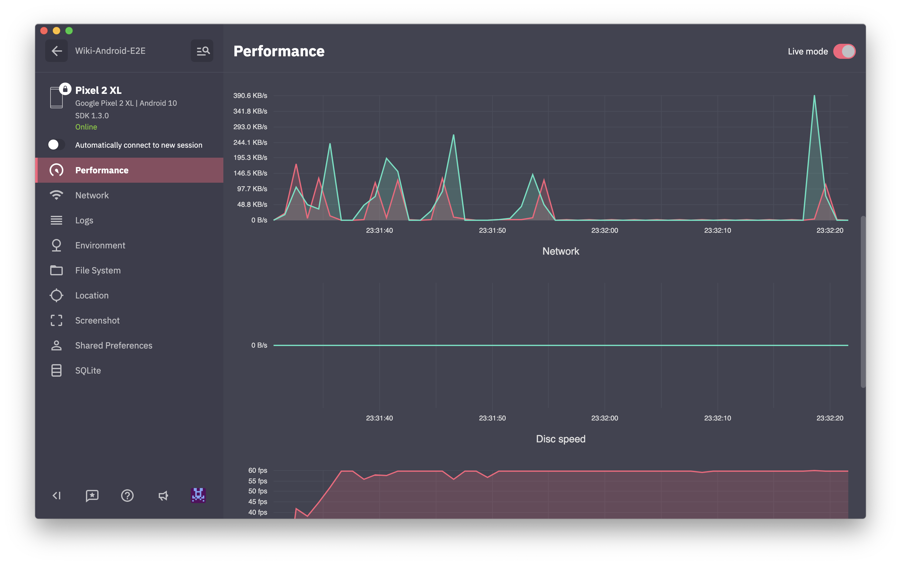

# 

With AppSpector you can remotely debug your app running in the same room or on another continent. 
You can measure app performance, view database content, logs, network requests and many more in realtime. 
This is the instrument that you've been looking for. Don't limit yourself only to simple logs. 
Debugging doesn't have to be painful!

* [Installation](#installation)
  * [Gradle dependency](#add-appspector-sdk-to-your-buildgradle)
  * [Initialize AppSpector](#initialize-appspector-sdk)
  * [Build and Run](#build-and-run)
* [Configure](#configure)
  * [SDK start/stop](#sdk-startstop)
  * [Custom device name](#custom-device-name)
  * [Getting session URL](#getting-session-url)
* [Features](#features)

# Installation

Each app you want to use with AppSpector SDK you have to register on the web (https://app.appspector.com).
After adding the application navigate to app settings and copy API key.

## Add AppSpector SDK to your build.gradle
<!-- integration-manual-start -->
[](https://github.com/appspector/android-sdk)

```groovy
buildscript {
  repositories {
      jcenter()
      google()
      maven {
          url "https://maven.appspector.com/artifactory/android-sdk"
      }
  }
  
  dependencies {
      classpath "com.appspector:android-sdk-plugin:$lastVersion"
  }
}

apply plugin: 'com.android.application'
// Put AppSpector plugin after Android plugin
apply plugin: 'com.appspector.sdk'

repositories {
    maven {
        url "https://maven.appspector.com/artifactory/android-sdk"
    }
}

dependencies {
    implementation "com.appspector:android-sdk:$lastVersion"
}
```
<!-- integration-manual-end -->

## Initialize AppSpector SDK
<!-- initialization-manual-start -->
```java
import android.app.Application;

import com.appspector.sdk.AppSpector;

public class AmazingApp extends Application {

   @Override
   public void onCreate() {
      super.onCreate();
      
      // We recommend to start AppSpector from Application#onCreate method
      
      // You can start all monitors
      AppSpector
            .build(this)
            .withDefaultMonitors()            
            .run("API_KEY");
            
      // Or you can select monitors that you want to use
      AppSpector
            .build(this)
            .addPerformanceMonitor()
            .addHttpMonitor()
            // If specific monitor is not added then this kind of data won't be tracked and available on the web
            .addLogMonitor()
            .addScreenshotMonitor()
            .addSQLMonitor()
            .run("API_KEY");
   }

}
```
<!-- initialization-manual-end -->

## Build and Run

Build your project and see everything work! When your app is up and running you can go to https://app.appspector.com and connect to your application session.


# Configure

## SDK start/stop

AppSpector start is two step process.
When you link with AppSpector framework it starts to collect data immediately after load. When you call `run` method - AppSpector opens a connection to the backend and from that point you can see your session on the frontend.

You can manually control AppSpector state by calling `start` and `stop` methods.
`stop` tells AppSpector to disable all data collection and close current session.
`start` starts it again using config you provided at load. This will be a new session, all activity between `stop` and `start` calls will not be tracked.

```java
AppSpector.shared().stop();
AppSpector.shared().start();
```

## Custom device name

You can assign a custom name to your device to easily find needed sessions in the sessions list. To do this you have to add the desired name as a value for `AppSpector.METADATA_KEY_DEVICE_NAME` key to the `metadata` dictionary:

```java
AppSpector
            .build(this)
            .withDefaultMonitors()
            .addMetadata(AppSpector.METADATA_KEY_DEVICE_NAME, "YOUR_DEVICE_NAME")
            .run("YOUR_API_KEY");
```

## Getting session URL

Sometimes you may need to get URL pointing to current session from code. Say you want link crash in your crash reporter with it, write it to logs or display in your debug UI. To get this URL you have to add a session start callback:

```java
AppSpector.shared().setSessionUrlListener(new SessionUrlListener() {
    @Override
    public void onReceived(@NonNull String sessionUrl) {
        // Save url for future use...
    }
});
```

# Features
AppSpector provides many monitors that tracks different activities inside your app:

#### SQLite monitor
Provides browser for sqlite databases found in your app. Allows to track all queries, shows DB scheme and data in DB. You can issue custom SQL query on any DB and see results in browser immediately.


#### HTTP monitor
Shows all HTTP traffic in your app. You can examine any request, see request/response headers and body.
We provide XML and JSON highliting for request/responses with formatting and folding options so even huge responses are easy to look through.


#### Logs monitor
Displays all logs generated by your app.


#### Location monitor
Most of the apps are location-aware. Testing it requires changing locations yourself. In this case, location mocking is a real time saver. Just point to the location on the map and your app will change its geodata right away.


#### Performance monitor
Displays real-time graphs of the CPU / Memory / Network / Disk / Battery usage.



#### Screenshot monitor
Simply captures screenshot from the device.


# Feedback
Let us know what do you think or what would you like to be improved: [info@appspector.com](mailto:info@appspector.com).

[Join our slack to discuss setup process and features](https://slack.appspector.com)
